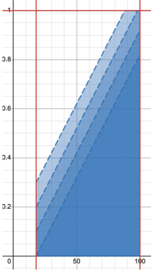
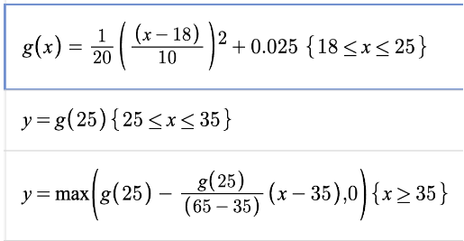
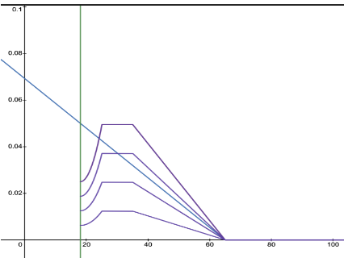
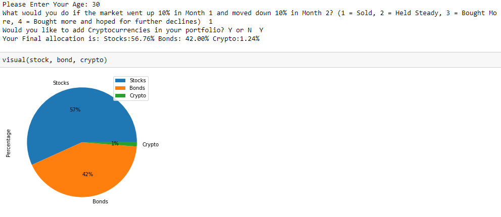
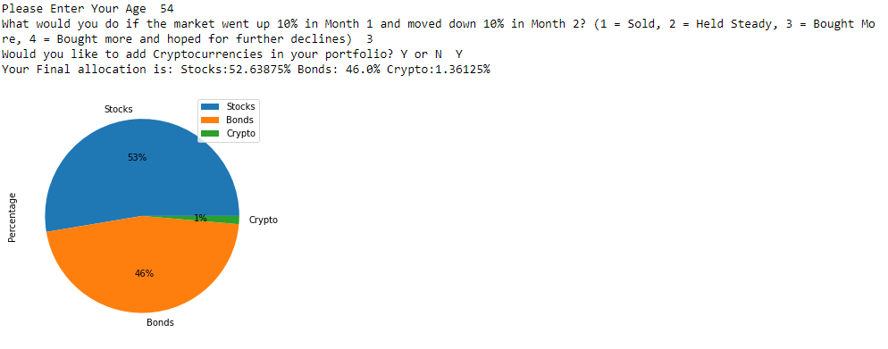

 
## Project overview
The basis of our project is to create an algorithm that acts as a robo-financial-advisor. Our goal is to have an input user answer a series of questions and then use our algorithm to push out a portfolio of various ETFs. Our algorithm takes into account typical financial advising factors such as age, risk tolerance, and asset allocation preferences. From these preferences our algorithm will push out a portfolio of specific ETFs and list what each ETF allocation should consist of. 
Our questionnaire focused on the following areas:
    Age

    Risk Tolerance

    Willingness to invest in foreign markets, emerging economies, crypto, REIT’s
 
Based on the answers given to the above questions, the tool starts filtering out assets from our database leaving the most suitable choices for further consideration. The main goal for the advisor is to build a reasonable portfolio which balances risk vs. reward by taking into account the client's needs.

## Installation
    Prerequisites:
    conda
    python3.7.13 or higher

    conda create --name portfolio_recommender --file requirements.txt
    conda activate portfolio_recommender

    Create a PostgresSQL database named “nu_project1” using your favorite method.

    Run this script to perform the preprocessing step - if your postgresl username/password is not “postgres” you have to edit the db url in populate_db.py correspondingly:
    python populate_db.py

    To run the portfolio recommender, run:
    python portfolio_recommender.py

## Limitations and future development
    There were several limitations to our project. Amongst these was a lack of extensive time. Given more time we would have expanded the model even further and added more features to it. We would have added a function that would allow an input user to create a portfolio centered around ESG investing incentives. Additionally, we would have added more cryptocurrencies to choose from.

    Due to the limited time, we were not able to include factors that play a big role in making an even better investment decision, such as: job position, disposable income, student loans, willingness for regular versus one-time contributions, number of dependents, city of residence, post-retirement goals, etc.

    We also would have liked to have been able to write a more complex, nonlinear function to calculate our stock-to-bond allocation percentages. Additionally, a more rigorously calculated selection and allocation of equity and bond baskets would’ve improved portfolio performance.

    Additional analysis can be done to show more statistics on the portfolio, as well as simulations.

    Generally, we had to make “arbitrary” decisions for ETF selection based on our best judgment, and each of those decisions can be reevaluated and given more research to improve robustness.

## Data pre-processing
A large part of our project was filtering out the correct data in order to fit it into a database with which we could create portfolios with. This was a multi-step process. We decided as a group that we only wanted to select ETFs that have developed an extensive track record over a longer period of time. Since ETFs are created every day, we chose to exclude those with which there wasn’t much price history. From this, we filtered out every ETF that didn’t have a minimum of five years of existence. In addition to this, we decided that since we are focusing on portfolio management, we are only suggesting products that are meant to be bought and held for a minimum time period of multiple years. This eliminated ETFs that were more short-term trade oriented such as leveraged ETFs, inverse ETFs, ultrashort ETFs. Once these steps were completed we had a general sense of the ETFs that would be included in the basket. 

The next step in our portfolio selection process was to divide the ETF’s into their special interest categories. The basis of our project is to have a consumer insert their list of investing desires, and we would then push back a portfolio that meets their needs. Among these potential needs are a desire to invest in foreign equities, real estate vehicles, cryptocurrencies, as well as stocks and bonds. From our previous broad-based basket, we separated our ETF’s into these special interests groups. From this, we created a basket of ETFs that included Equity ETFs, Bond ETFs, Foreign Equity ETFs, and Real Estate ETFs. 

A major part of portfolio optimization is taking the appropriate risk tolerance of the input consumer and giving back a specific portfolio that meets their desired risk tolerances. Based on our consumer surveys, we will be able to determine what level of risk our consumer desires. Due to this, we need to match the input user with a portfolio that matches their risk tolerance desires. For this, we needed to divide our equity ETFs and bond ETFs into various baskets based on how much risk exposure each ETF takes on. 

To find out the risk levels of each ETF, we took the betas of each ETF into consideration. ETFs that have lower betas would, in turn, contain less risk than ETFs that have high betas. From here, we separated our equity ETFs into five different baskets that ranged in risk levels. These baskets included “low beta”, “low-medium beta”, “medium beta”, “high-medium beta”, and “high beta.” The risk of each ETF increases as you go from low-to-high beta. Input users who are “risk-seeking” will have higher exposure to the “high-medium beta” and “high beta” baskets than input consumers who are less risk-seeking. 

For our bond ETF risk determinants, we broke the bond ETFs into three separate categories. These categories included “low-risk bonds”, “mid-risk bonds”, and “high-risk bonds.” We were able to determine the proper annotation based on the makeup of the bond ETF. Generally, bonds are graded on a scale that measures how risky the bond is. This scale contains highly safe and secure bonds, rated AAA, AA, and A, to less safe but moderately secure rated BBB bonds, to high-risk but high-reward bonds BB, B, and CCC grades. We determined that bond ETFs that were rated AAA, AA, or A would be considered “low-risk bonds”, while bond ETFs with a large exposure to BBB graded bonds would be considered “mid-risk bonds”, and bond ETFs with large exposures to BB, B, or CCC would be considered “high-risk bonds.” 

From the above data cleaning, we created baskets that will make up the entire exposure of an input user’s desired investment goals. This will give the input user a portfolio that meets their investing goals. 

 
## Usage and installation instructions of libraries/tools that are used
### For this project we used the following list of libraries:
    Pandas 
    Csv 
    Numpy
    Path
    Matplotlib 
    Sqlalchemy
 
## Additional explanations
A major part of portfolio optimization is determining the allocation of different asset classes within a portfolio. The most basic form of this is determining the allocation of assets into equities and bonds. We have decided to implement this allocation into our portfolio, while also giving the input user a choice to add allocation exposure to foreign equity ETFs, real estate ETFs, and cryptocurrencies. The role of a portfolio advisor is  to calculate the proper allocation percentage to each asset class. Their are several factors that go into determining allocation percentages such as age, risk tolerance, and investing goals. For our model, we lean heavy into the age and risk tolerance input factors. 
The first major allocation to determine is the equity-to-bond allocation percentage. To determine this we took the age and risk tolerance of the input user. The following function allows for the calculation of equity-to-bond allocation:

The function where “r” is the risk tolerance level and x is the input user’s age will give the proper equity-to-bond exposure. Our model takes into account four separate risk categories. Based on this, an input user will have a equity-to-bond exposure somewhere along this function line:

The x-axis in this chart is the input-users age and the y-axis is the input user’s exposure to bonds. As the user increases in age the less exposure they need to equities. The shades of blue in the diagram are dependent upon the risk tolerance of the input user. The more risk-seeking they are, the more exposure to equities they will have. 

Once we have the input users stock to bond exposure percentages, our model takes into account their preferences. For our model, we gave input users the ability to gain exposure to foreign equity ETFs and real estate ETFs. We decided that these exposure percentages would come from the input users equity exposure. We determined that if the input user selects the option to gain foreign equity and real estate ETF exposure, we will take 10% of their equity exposure and put it into their preferred basket choice. For example, if an input user has a 65% exposure to equity ETFs, and they want to have foreign equity exposure, they will now have 55% equity exposure and 10% foreign equity exposure. 
The next component of our portfolio allocation is cryptocurrency exposure. We decided that exposure to crypto would be non-linear unlike our other exposure allocations. We believe that exposure to crypto should increase from an 18-year old’s perspective until they reach about 25-years old, from which it should stagnate for 10-years and then decrease towards zero the older the investor gets. We believe that this should be the case due to crypto’s high volatility. The function for crypto exposure is as follows (x= age):

                                          

The area for crypto exposure visualization is displayed in the following graph: 

The purple lines represent the percentage amount of crypto exposure based on risk preference. Initially, we intended for crypto exposure to be more linear, this is indicated by the blue line of the graph. As we went on we decided to make the exposure more dynamic based on different stages in a career an input user is. That dynamism is shown by the purple lines. 

Once we have exposures to the asset classes we need to determine the individual ETF exposures. We determined that each portfolio would have a select number of ETFs from each asset class. We decided that we would select ten equities to be put into each equity exposure basket. These ten ETFs would be determined based on which ETFs had the highest “Sharpe Ratio” over the past five years. For foreign equities, we determined that exposure would come from a basket of fifteen ETFs. This larger basket is due to the fact that foreign equities are much riskier and volatile than domestic equities, so risk needs to be spread out wider. Once again, the fifteen ETF’s from this basket were determined by which ETFs had the highest “Sharpe Ratio” over the previous five years. For real estate ETF exposure, we drew upon a basket of seven ETFs. There are not that many ETFs in this space and we believe this number will represent a good amount of exposure to this area. The basket of which individual ETFs was determined by choosing the ETFs that had the highest “Sharpe Ratio” performance over the previous five years.

## Examples 
### Scenario 1 
    (insert images titled 54_year_old_ex_1_3 & 25_year_old_ex_1_3)  
    For this example we have two users, one being 25 years old and another being 54 years old. We assumed that both want crypto-currencies in their portfolio and have a risk appetite of 3 
    As per the pie chart and allocation we can see how our functions work in order to provide a unique allocation for each user: 
    The 25 year-old has an allocation of 
    Stocks : 79.29%
    Bonds: 17.0%
    Crypto: 3.71% 
    On the other hand the 54 year old will have an allocation of Allocation:
    Stocks : 52.64%
    Bonds: 46.00%
    Crypto: 1.36%

### Scenario 2 
    (insert images titled 30_year_old_ex_2_4 & 3-_year_old_ex_2_1) 
    Our second example we will standardize age at 30 years old but differing risk appetites - A 30 year old with risk appetite of 1 which is the most risk averse against a risk tolerance of 4 which is the highest risk profile available 
    having a risk tolerance of 1 outputs an allocation of:
    Stocks : 56.76%
    Bonds: 42.00%
    Crypto: 1.24%
    With a risk tolerance of 4 we get an allocation of:
    Stocks : 83.05%
    Bonds: 12.0%
    Crypto: 4.95%

## References used
    https://smartasset.com/investing/asset-allocation-calculator#dGIetOVSrl
    https://www.optimizedportfolio.com/asset-allocation/#asset-allocation-by-age-calculation
    https://www.kaggle.com/datasets/stefanoleone992/mutual-funds-and-etfs
    
## Team members:
    Minh
    Drew
    Alejandro 
    Bek

